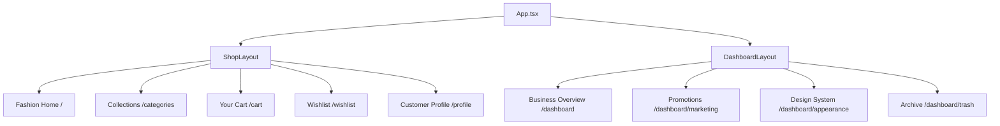

# Classified Luxury Fashion

A premium, highly customizable React-based fashion e-commerce platform featuring a sophisticated design system, high-end aesthetics, and a dynamic customization engine. Built with React 19, TypeScript, and Vite, it delivers a luxury shopping experience with seamless performance.

## ✨ Core Features

### 🛍️ **E-Commerce Experience**

- **Premium Product Catalog**: Curated view of high-end fashion items with smooth transitions.
- **Visual Discovery**: Category-based exploration designed for fashion-forward users.
- **Seamless Cart & Wishlist**: Polished workflows for managing desired items and purchases.
- **Dynamic Profile Insights**: Role-specific dashboards for customers and store management.

### 🎨 **Luxury Aesthetics & Customization**

- **Theme Engine**: Light, Dark, and System modes with refined contrast and accessibility.
- **Accent Personalization**: Real-time color updates using a curated palette.
- **Typography Selection**: Premium fonts including Inter, Poppins, SF Pro, and Urban Grotesk.
- **Artistic Backgrounds**:
  - **Minimal**: Subtle dot grid for a clean look.
  - **Gradient**: Dynamic radial gradients for depth.
  - **Noise**: Textured overlays for a tactile feel.
  - **Branded**: Sophisticated diagonal stripe patterns.

### 📱 **Adaptive Interface**

- **Smart Sidebar**:
  - **Standard**: Full-featured navigation for deep workflows.
  - **Compact**: Balanced density for efficiency.
  - **Minimal**: Icon-only navigation for maximum visual focus.
- **Mobile First**: GPU-accelerated mobile sidebar with smooth animations and glass morphism effects.
- **Polished Motion**: Professional cubic-bezier easing for every interaction.

## 🚀 Tech Stack

- **React 19** - Modern foundation for high-performance UI.
- **TypeScript** - Robust, type-safe development environment.
- **Vite** - Lightning-fast build and development tool.
- **Lucide React** - Elegant, consistent iconography.
- **CSS3 Modern** - Advanced styling using custom properties and glass morphism.

## 📦 Getting Started

### Prerequisites

- Node.js (v18+)
- npm or yarn

### Setup

1. **Clone & Enter**
   ```bash
   git clone <repository-url>
   cd Classified
   ```
2. **Install**
   ```bash
   npm install
   ```
3. **Launch**
   ```bash
   npm run dev
   ```

## 🔐 Credentials & Roles

The platform uses a role-based access system to demonstrate various user experiences:

| Role               | Email                      | Password       | Environment          |
| :----------------- | :------------------------- | :------------- | :------------------- |
| **Store Owner**    | `owner@classified.com`     | `owner123`     | Management Dashboard |
| **Marketing Lead** | `marketing@classified.com` | `marketing123` | Campaign Dashboard   |
| **Loyal Customer** | `customer@classified.com`  | `customer123`  | Shopping Profile     |

## 🏗️ Technical Architecture



## 📁 Project Structure

```
Classified/
├── src/
│   ├── components/
│   │   ├── dashboard/    # Internal management UI
│   │   ├── shop/         # High-end customer UI
│   │   ├── common/       # Fundamental UI primitives
│   │   └── features/     # Specialized e-commerce modules
│   ├── context/          # State management & Auth
│   ├── types/            # Type definitions
│   ├── pages/
│   │   ├── dashboard/    # Back-office admin pages
│   │   └── shop/         # Luxury shopping pages
│   ├── App.tsx           # Core routing & themes
│   └── index.css         # Global design system
├── public/               # Static fashion assets
└── package.json          # Systems & dependencies
```

## 🎨 Global Configuration

### Customizing the Default Look

You can adjust the initial state in `App.tsx` (lines 26-30):

- **Theme**: Set to `Dark`, `Light`, or `System`.
- **Accent**: Edit the hex code for the default branding color.
- **Pattern**: Choose a default `BackgroundPattern`.

## 🤝 Contribution

This is a private project focused on delivering a world-class fashion e-commerce experience.

---

**Crafted for High-End Fashion Experiences**
